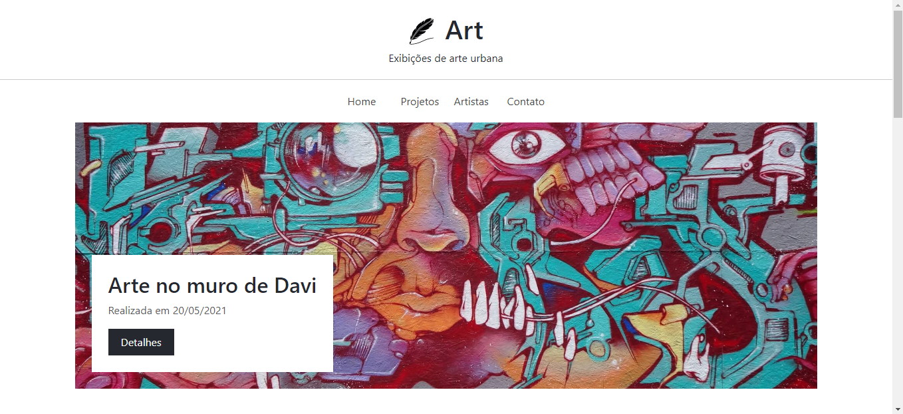

<!-- CABEÇALHO -->

<!-- TÍTULO -->
<h1 align="center" alt="title">
  
    <b> PROJETOS COM BOOTSTRAP FRAMEWORK </b>
  
</h1>

 

Bootstrap é um framework web com código-fonte aberto para desenvolvimento de componentes de interface e front-end para sites e aplicações web, usando HTML, CSS e JavaScript, baseado em modelos de design para a tipografia, melhorando a experiência do usuário em um site amigável e responsivo.

 

&nbsp;  
&nbsp;
&nbsp;
&nbsp;
&nbsp;
&nbsp;

---

<!-- Projects -->
**Projeto_001_Art_Template**

---
<!-- RODAPÉ -->
 

  <tabela>
    <tr>
      <td>
        
      </td>
      <td>
        
      </td>
      <td>
        
      </td>
    </tr>
  </table>

